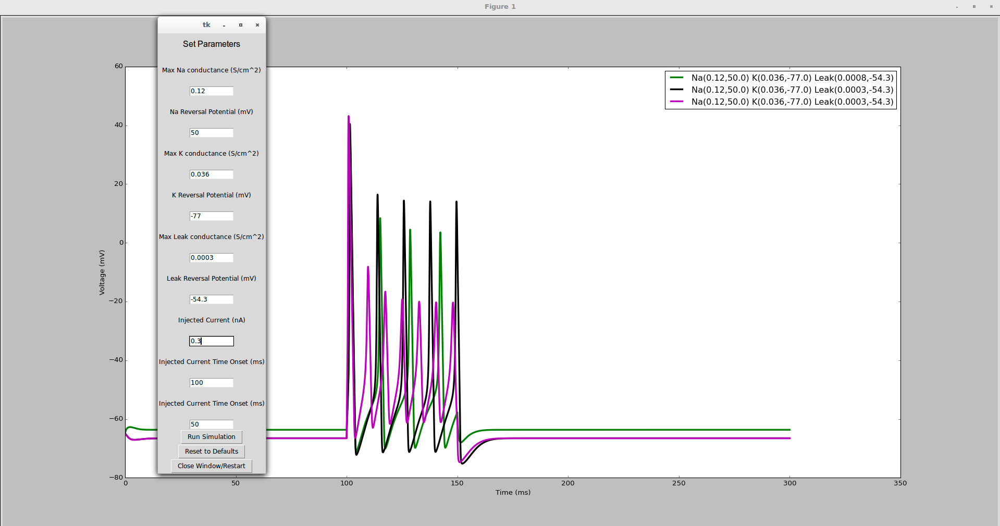

###########################################################
#      Neuron Interfaced With Python + Tkinter GUI        #
#                                                         #
###########################################################

This program is meant as a teaching application for basic biophysics princples in neuroscience.

The program calls neuron via a python interface and allows the user to change basic biophysical properties of a simple, but biophysically realistic model of a neuron.

Basic Hodgkin-Huxley ion channels are use (Na, K, Leak) and the user can modify and observe how a cell would respond to manipulation of the cells physiological proerties.

The model can be made more realistic by inserting more channels and adding dendrites, axons and connections from other neurons.

The basics of the neuron-python interface can be found here: http://www.neuron.yale.edu/neuron/static/new_doc/programming/python.html

Credits:
::::::::::::::::Neuron:::::::::::::::::::::::::
Carnevale, N.T. and Hines, M.L. The NEURON Book. 
Cambridge, UK: Cambridge University Press, 2006. 

